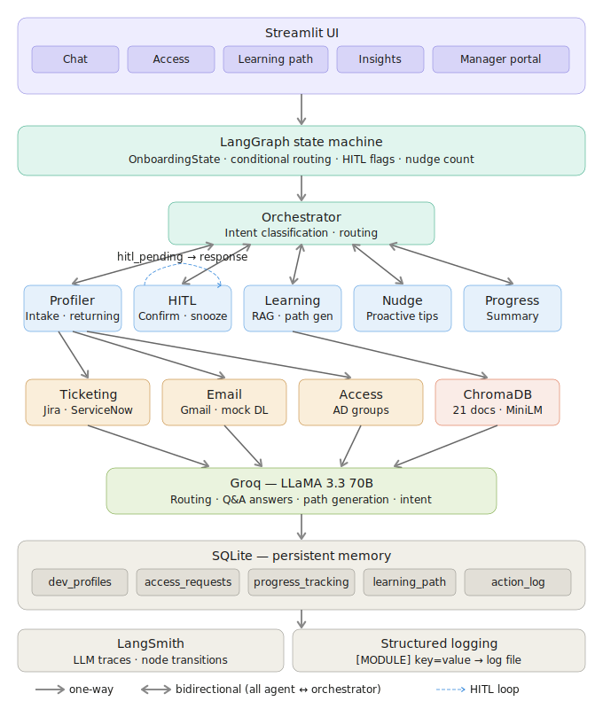
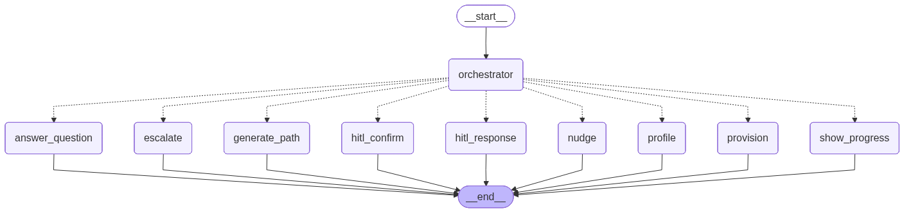

# 🤝 AI Onboarding Buddy

> An agentic AI system that autonomously onboards new software engineers — provisioning system access, building personalised learning paths, and guiding developers through their team's knowledge base via conversational AI.


---



## What It Does

Traditional developer onboarding involves manual ticket-raising, chasing DL owners, reading through wikis, and waiting days for access. **AI Onboarding Buddy** automates the entire process end-to-end:

| Step | What the agent does |
|------|---------------------|
| **Profile intake** | Collects developer details via natural conversation, detects returning users |
| **Access provisioning** | Raises Jira/ServiceNow tickets, sends DL subscription emails, submits AD group requests — all automatically |
| **Welcome email** | Sends a real email to the developer's inbox via Gmail SMTP |
| **Learning path** | Generates a personalised, sequenced reading plan based on team, role, and skill gaps |
| **RAG Q&A** | Answers questions about systems, tools, and processes — grounded in the knowledge base |
| **Progress tracking** | Tracks which topics the developer has covered and which documents they've read |
| **HITL confirmation** | Asks the developer to confirm document completion after repeated engagement |
| **Manager approvals** | Role-protected manager screen for approving/rejecting access requests |
| **Analytics** | Insights dashboard showing learning progress, topic coverage, session history, agent audit log |

---

## Architecture

```
┌─────────────────────────────────────────────────────────────┐
│                    Streamlit UI (app/)                       │
│   Developer View          │         Manager Portal          │
│   Chat · Access ·         │    Password-gated · Approval    │
│   Learning Path · Insights│    queue · Audit history        │
└───────────────┬───────────┴────────────┬────────────────────┘
                │                        │
                ▼                        ▼
┌─────────────────────────────────────────────────────────────┐
│              LangGraph State Machine (graph.py)              │
│                                                             │
│  orchestrator_node                                          │
│       │                                                     │
│       ├──▶ profile_node        (intake + returning user)    │
│       ├──▶ provision_node      (tickets + emails + AD)      │
│       ├──▶ generate_path_node  (LLM learning path)          │
│       ├──▶ answer_question_node(RAG Q&A)                    │
│       ├──▶ progress_node       (summary)                    │
│       ├──▶ nudge_node          (proactive suggestions)      │
│       ├──▶ hitl_confirm_node   (HITL interrupt)             │
│       ├──▶ hitl_response_node  (Yes/No processing)          │
│       └──▶ escalate_node       (error handling)             │
└───────────────┬─────────────────────────────────────────────┘
                │
        ┌───────┼────────────────────┐
        ▼       ▼                    ▼
┌──────────┐ ┌──────────────┐ ┌──────────────────────────────┐
│  Agents  │ │    Tools     │ │          Memory               │
│          │ │              │ │                               │
│profiler  │ │ticketing.py  │ │profile_store.py (SQLite)      │
│learning  │ │email.py      │ │  developer_profiles           │
│orchestr. │ │access.py     │ │  access_requests              │
└──────────┘ └──────────────┘ │  dl_subscriptions             │
                               │  agent_action_log             │
┌─────────────────────────┐   │                               │
│  Vector Store (ChromaDB)│   │progress.py (SQLite)           │
│  21 knowledge base docs │   │  sessions                     │
│  all-MiniLM-L6-v2       │   │  progress_tracking            │
│  Chunk: 500 / Overlap:  │   │  learning_path                │
│  100 · Top-K: 4         │   └──────────────────────────────┘
└─────────────────────────┘
```

---

## Key Technical Patterns

### 1. Agentic Orchestration (LangGraph)
The system uses a **stateful directed graph** rather than a simple chain. The orchestrator node classifies intent, checks state flags, and routes to the appropriate node on every turn. State persists across the conversation including profile completeness, provisioning status, HITL flags, and nudge counts.

### 2. Retrieval-Augmented Generation (RAG)
The knowledge base contains 21 markdown documents across 3 categories (Onboarding, Architecture, Runbooks). Documents are chunked (500 tokens, 100 overlap), embedded with `sentence-transformers/all-MiniLM-L6-v2`, and stored in ChromaDB. At query time, top-4 chunks are retrieved and injected into the LLM context with a grounding system prompt.

### 3. Human-in-the-Loop (HITL)
After a developer asks 3+ questions about the same document, the agent interrupts on the next casual message and asks if they want to mark it complete. The interrupt respects:
- **Intent gating** — only fires on SMALL_TALK, OTHER, or COMPLAINT (never mid-question)
- **Snooze** — if declined, waits 3 more questions before re-asking
- **Suppression window** — doesn't re-check on every message during question streaks

### 4. Returning User Detection
On the first message of any session, the profiler checks the DB for a name match. If found, the full profile is loaded, a new session is started, and all workflow flags are restored — skipping re-intake entirely.

### 5. Proactive Nudging
After every 3 questions answered, the agent proactively suggests the developer's next unread document. A `last_nudge_count` guard in graph state prevents the nudge from re-firing until the count advances.

### 6. Business Hours Auto-Completion
DL subscriptions automatically transition from `email_sent` to `subscribed` after 24 business hours (Mon–Fri 09:00–17:00 UTC), simulating the DL owner manually adding the developer in Outlook.

---

## Tech Stack

| Layer | Technology |
|-------|-----------|
| **LLM** | Groq — LLaMA 3.3 70B Versatile |
| **Agentic orchestration** | LangGraph |
| **LLM framework** | LangChain |
| **Embeddings** | HuggingFace `sentence-transformers/all-MiniLM-L6-v2` |
| **Vector store** | ChromaDB |
| **Database** | SQLite (WAL mode) |
| **UI** | Streamlit (multipage) |
| **Observability** | LangSmith + structured local logging |
| **Email** | Gmail SMTP (real) + mock fallback |
| **Runtime** | Python 3.11 |

---

## Project Structure

```
ai-onboarding-buddy/
├── app/
│   ├── main.py                    # Developer UI (4 tabs)
│   └── pages/
│       └── manager.py             # Manager approval portal
├── agents/
│   ├── orchestrator.py            # Routing brain + response builders
│   ├── profiler.py                # Profile intake + returning user detection
│   └── learning.py                # RAG Q&A + learning path generation
├── tools/
│   ├── ticketing.py               # Mock Jira/ServiceNow
│   ├── email.py                   # Gmail SMTP + mock DL emails
│   └── access.py                  # Mock AD group provisioning
├── memory/
│   ├── profile_store.py           # Developer profiles, tickets, DL subs, audit log
│   └── progress.py                # Sessions, progress, learning path, HITL
├── data/
│   ├── mock_docs/                 # 21 markdown knowledge base documents
│   │   ├── onboarding/            # 9 docs: Day 1, team norms, VPN, access, etc.
│   │   ├── architecture/          # 6 docs: system overview, auth, payments, etc.
│   │   └── runbooks/              # 6 docs: deployment, incident response, etc.
│   ├── mock_db/
│   │   ├── onboarding.db          # SQLite database
│   │   ├── teams.json             # Team definitions + required systems/skills
│   │   ├── systems.json           # System definitions + SLA + ticket config
│   │   └── dl_groups.json         # Distribution list definitions
│   └── seeds/
│       ├── gen_db.py              # Creates DB schema + seeds sample data
│       ├── embed_docs.py          # Chunks docs → embeddings → ChromaDB
│       └── validate_json_schema.py# Pre-flight JSON validation
├── graph.py                       # LangGraph entry point + state schema
├── config.py                      # All constants, paths, logging, LangSmith
├── .streamlit/
│   └── config.toml                # Dark theme configuration
├── .env.example                   # Environment variable template
└── requirements.txt
```

---

## Setup

### Prerequisites
- Python 3.11
- Groq API key (free tier sufficient) — [console.groq.com](https://console.groq.com)
- LangSmith API key (optional, for tracing) — [smith.langchain.com](https://smith.langchain.com)
- Gmail App Password (optional, for real welcome emails)

### Installation

```bash
# 1. Clone and create virtual environment
git clone <repo-url>
cd ai-onboarding-buddy
python -m venv .venv
.venv\Scripts\activate          # Windows
# source .venv/bin/activate     # Mac/Linux

# 2. Install dependencies
pip install -r requirements.txt

# 3. Configure environment
cp .env.example .env
# Edit .env and add your GROQ_API_KEY

# 4. Initialise the database
python data/seeds/validate_json_schema.py
python data/seeds/gen_db.py

# 5. Build the vector store
python data/seeds/embed_docs.py

# 6. Run the app
streamlit run app/main.py
```

### Environment Variables

```env
# Required
GROQ_API_KEY=your_groq_api_key

# Optional — LangSmith tracing
LANGCHAIN_TRACING_V2=false
LANGCHAIN_API_KEY=your_langsmith_key
LANGCHAIN_PROJECT=onboarding-buddy
LANGCHAIN_ENDPOINT=https://api.smith.langchain.com

# Optional — Real welcome emails via Gmail
GMAIL_SENDER_EMAIL=your.sender@gmail.com
GMAIL_APP_PASSWORD=your_16_char_app_password
```

---

## Manager Portal

Navigate to the **Manager** page in the Streamlit sidebar. Sign in with a manager email to see pending access requests from direct reports and approve or reject them.

Demo credentials:

| Email | Password |
|-------|----------|
| `james.thornton@techcorp.com` | `manager123` |
| `sarah.kim@techcorp.com` | `manager123` |

Approval/rejection updates the developer's Access tab in real time and is recorded in the agent action audit log.

---

## Sample Conversation Flow

```
Developer: "Hi, I'm Maya Sehgal joining the Risk & Compliance team"

Buddy:  Asks for email, role, experience level, manager name

        [Profile complete → auto-provisions:]
        ✅ 6 Jira/ServiceNow tickets raised
        ✅ 4 DL subscription emails sent
        ✅ 3 AD group requests submitted
        ✅ Welcome email sent to maya@gmail.com
        ✅ Personalised 10-doc learning path generated

Developer: "How do I set up my VPN?"
Buddy:  Retrieves from knowledge base → answers with source citation
        Records topic: "VPN Setup" → source: onboarding/vpn_access.md

[After 3 questions about access_provisioning.md + casual message:]
Buddy:  "You've been exploring access provisioning in depth.
         Would you like to mark the Access Provisioning Guide as complete?"
Developer: "yes"
Buddy:  ✅ Document marked complete, learning path updated
```

---

## Observability

**LangSmith** — enable by setting `LANGCHAIN_TRACING_V2=true`. All LLM calls, tool invocations, and graph node transitions are traced automatically.

**Local logs** — written to `logs/onboarding_buddy.log` and terminal. Every module logs with a `[MODULE]` prefix and structured `key=value` fields:

```
2026-03-20 10:58:07  INFO  [ORCHESTRATOR] → route=PROVISION
2026-03-20 10:58:08  INFO  [TICKETING] ticket raised — ticket_id='JIRA-26573' system='Jira' sla_hours=24
2026-03-20 10:58:14  INFO  [EMAIL] send_welcome_email — using REAL Gmail SMTP
2026-03-20 10:58:15  INFO  [ACCESS] AD group request submitted — group='grp-risk-eng' status='provisioned'
2026-03-20 10:59:14  INFO  [GENERATE_PATH] LLM returned 10 documents
2026-03-20 10:59:38  INFO  [PROGRESS] get_hitl_candidate — candidate found doc='access_provisioning.md'
```

---

## Author

**Saneh Lata**  
AI Engineering | Technical Leadership | Product & Engineering Management  
Building production-grade agentic AI systems

---

*Built with LangGraph · Groq · ChromaDB · Streamlit*


pip install -r requirements.txt
python data/seeds/gen_docs.py       # validate all 21 docs exist
python data/seeds/validate_json_schema.py       # verify json schemas are in line with their usage
python data/seeds/gen_db.py         # create SQLite DB + seed developers
python data/seeds/embed_docs.py     # chunk → embed → store in ChromaDB
streamlit run app/main.py           # launch the app
```

One dependency note — `embed_docs.py` needs these packages in your `requirements.txt`:
```
langchain
langchain-text-splitters
langchain-huggingface
langchain-chroma
chromadb
sentence-transformers


## Agent Graph

